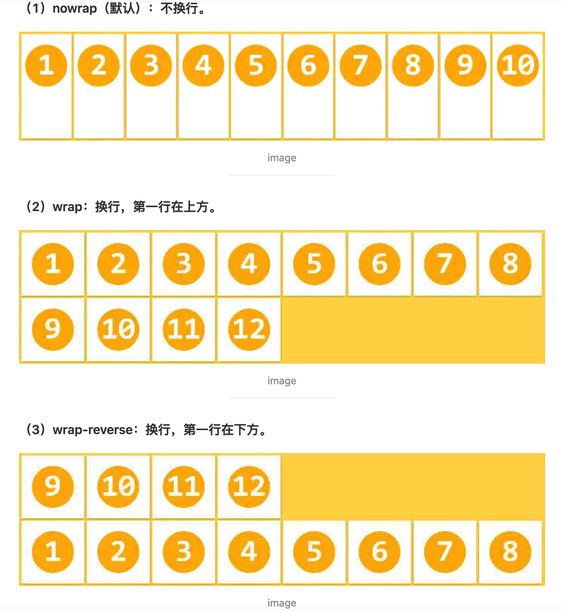
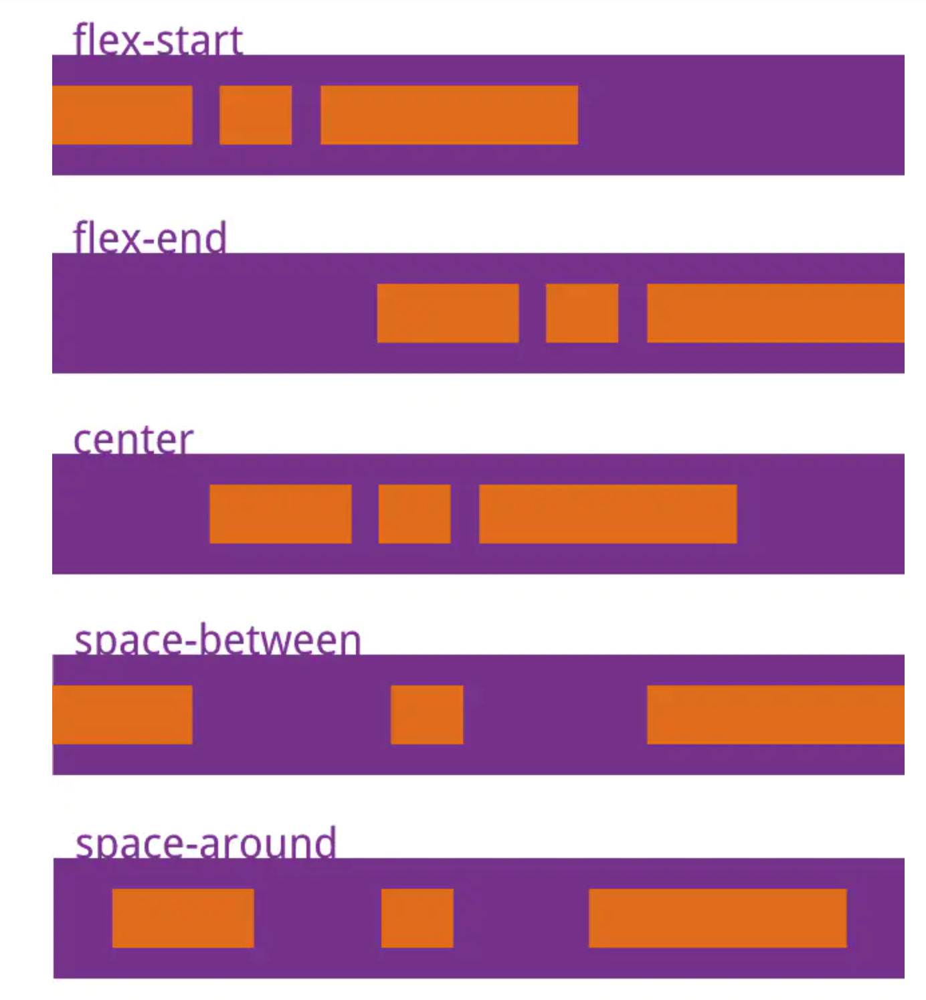
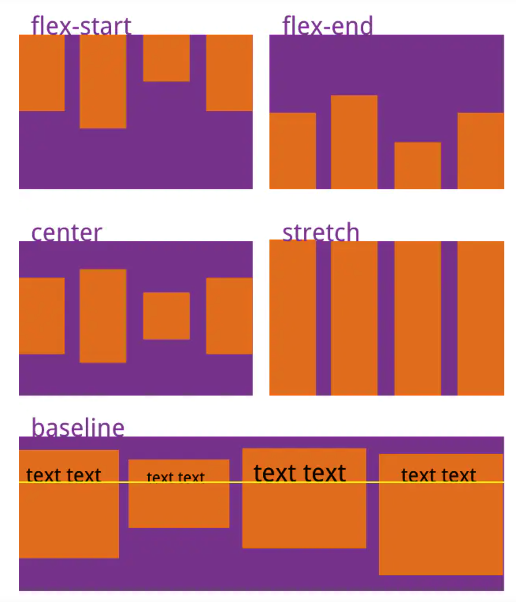

<!--
 * @Author: your name
 * @Date: 2020-12-13 14:50:50
 * @LastEditTime: 2020-12-13 16:26:26
 * @LastEditors: Please set LastEditors
 * @Description: In User Settings Edit
 * @FilePath: /webfeidian/MyBlog/Flex.md
-->
# Flex布局

----
## 1.基本概念
  Flex布局是Flexible Box意为“弹性盒子”，默认的是一个容器(container)中只有一行,
容器中的所有成员称为子元素(item)。

**两种方式**
```css
.contain{
    display:flex;
}
.contain{
    display:inline-flex;
}
```


## 2.容器的属性
* flex-direction 
* flex-wrap
* flex-flow
* justify-content
* align-items
* align-content


#### 2.1 flex-direction
  >即item在container中的排列方向
  ```css
    .container{
        height: 500px;
        display: flex;
        flex-direction: row | row-reverse | column | column-reverse;
        background-color:gray;
    }
    .item{
        width: 300px;
        height: 300px;
        margin: 30px;
        background-color: blue;
    }
  ```

* row（默认）：主轴水平，从左往右;
* row-reverse：主轴水平，从右往左;
* column：主轴垂直，从上往下;
* column-reverse：主轴垂直，从下往上;

#### 2.2 flex-wrap
>即主轴排列不下，item元素排列的方式

```css
    .container{
        height: 500px;
        display: flex;
        flex-direction: row;
        flex-wrap: nowrap | wrap | wrap-reverse;
        background-color:gray;
    }
```


* nowrap（默认）：主轴水平，从左往右;
* wrap：换行第二行从左往右开始;
* wrap-reverse：反向换行，第二行在上第一行在下;

#### 2.3 flex-flow
>即flex-direction flex-row的属性简写 
```css
    .container{
        height: 500px;
        display: flex;
        flex-flow: flex-direction flex-wrap;
        background-color:gray;
    }
```


#### 2.4 justify-content
>即item在主轴对齐的方式

```css
    .container{
        height: 800px;
        display: flex;
        flex-flow: column wrap;
        justify-content: flex-start | flex-end | center | space-between | space-around;
        background-color:gray;
    }
```

* flex-start（默认值）：左对齐
* flex-end：右对齐
* center： 居中
* space-between：两端对齐
* space-around：中间对齐


#### 2.5 align-items
>即元素在侧轴的对齐方式
```css
    .container{
        height: 800px;
        display: flex;
        flex-flow: row wrap;
        align-items: flex-start | flex-end | center | baseline | stretch;
        background-color:gray;
    }
```

* flex-start：侧轴（纵轴)的起点处对齐。
* flex-end：侧轴（纵轴)的终点处对齐。
* center：侧轴（纵轴)的中间处对齐。
* baseline：文字的基线处对齐。
* stretch：占满整个高度。


#### 2.6 align-content
样式同理justify-content，但是align-content是各个行item的对齐方式


## 3.子元素的属性
* order   （item排列的顺序，数值越小越靠前)
* flex-grow  (item放大的倍数,数值越大放大倍数越大)
* flex-shrink (item缩小的倍数，)
* flex-basis  (item在空余空间的大小)
* flex （flex-grow,flex-shrink,flex-basis缩写）
* align-self （单个item的样式，值可为 auto | flex-start | flex-end | center | baseline | stretch;）

